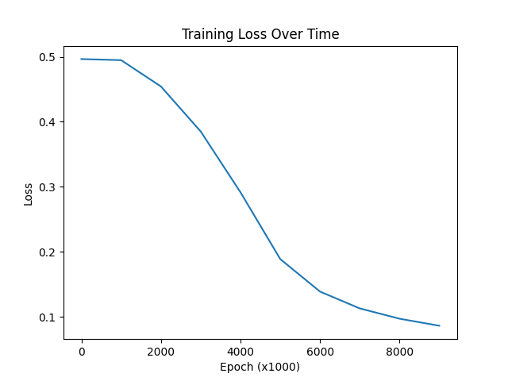

# Neural Network from Scratch
A feedforward neural network built from scratch using only NumPy. It solves the XOR problem; it learns through backpropagation.
## How It Works
The network consists of three layers: The input layer (2 neurons), the hidden layer (4 neurons), and the output layer (1 neuron).
The sigmoid function squashes the numbers into a value between 0 and 1 to make it readable as a probability.
The weights are adjusted 10,000 times through backpropagation until they produce the correct predictions. 
## How To Run
Install Dependency:
```
pip install numpy
```
Run the network:
```
python neural_net.py
```
## Results
The results should show how the loss decreased over time and the four correct predictions which are the solutions to the XOR problem.

```
Epoch 0, Loss: 0.4965
Epoch 1000, Loss: 0.4948
...
Epoch 9000, Loss: 0.0864

Final Predictions:
[0 0] -> 0.1013 | expected: 0
[0 1] -> 0.9269 | expected: 1
[1 0] -> 0.9201 | expected: 1
[1 1] -> 0.0593 | expected: 0
```
